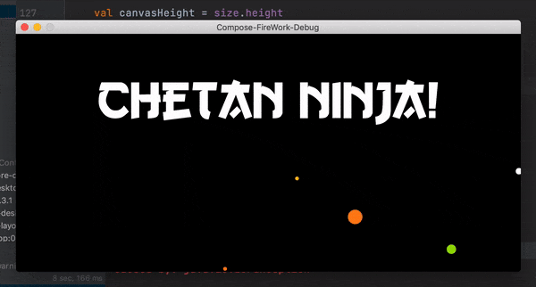

# Compose-Fruit-Ninja :kiwi_fruit: 
Welcome Fruit Ninja on Jetpack Compose Desktop 🚀, using Canvas API 🎨

## Featured on
- [jetc-dev](https://www.getrevue.co/profile/jetc/issues/jetc-dev-newsletter-issue-68-639848)

## How to Run
- From gradle tab from right-hand side
    - Select compose desktop => select `run`

## Preview :movie_camera:
 

 

## Other stuff I build
- [Compose Space-Invaders 👾](https://github.com/ch8n/Compose-SpaceWars)
- [3d Batman rain particle system :bat:](https://github.com/ch8n/Compose-Rain)
- [3d Space StarWars logo :alien:](https://github.com/ch8n/Compose-Stars)

## Built With 🛠
- [Kotlin](https://kotlinlang.org/) official programming language for Android development.
- [Jetpack Compose](https://developer.android.com/jetpack/compose) Android’s modern toolkit for building native UI.

## Build-tool 🧰
You need to have [Intellij Community](https://developer.android.com/studio/preview) to build this project.

## :eyes: Social
[LinkedIn](https://bit.ly/ch8n-linkdIn) |
[Medium](https://bit.ly/ch8n-medium-blog) |
[Twitter](https://bit.ly/ch8n-twitter) |
[StackOverflow](https://bit.ly/ch8n-stackOflow) |
[CodeWars](https://bit.ly/ch8n-codewar) |
[Portfolio](https://bit.ly/ch8n-home) |
[Github](https://bit.ly/ch8n-git) |
[Instagram](https://bit.ly/ch8n-insta) |
[Youtube](https://bit.ly/ch8n-youtube)

## :cop: License
Shield: [![CC BY-SA 4.0][cc-by-sa-shield]][cc-by-sa]

This work is licensed under a
[Creative Commons Attribution-ShareAlike 4.0 International License][cc-by-sa].

[![CC BY-SA 4.0][cc-by-sa-image]][cc-by-sa]

[cc-by-sa]: http://creativecommons.org/licenses/by-sa/4.0/
[cc-by-sa-image]: https://licensebuttons.net/l/by-sa/4.0/88x31.png
[cc-by-sa-shield]: https://img.shields.io/badge/License-CC%20BY--SA%204.0-lightgrey.svg
